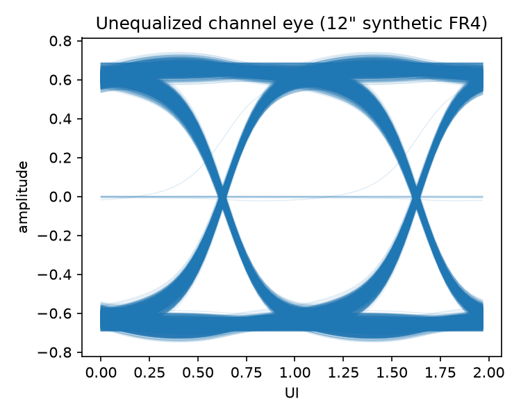
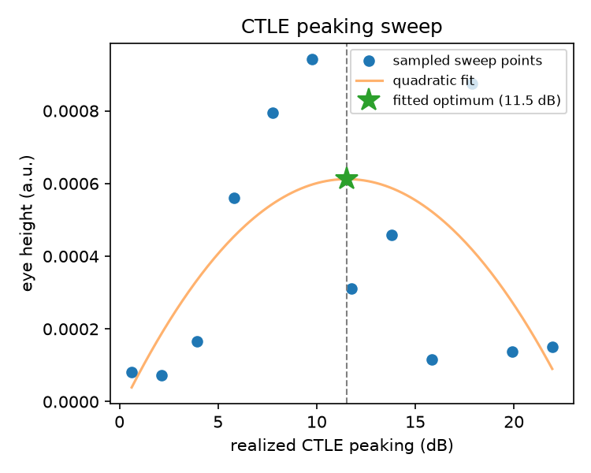
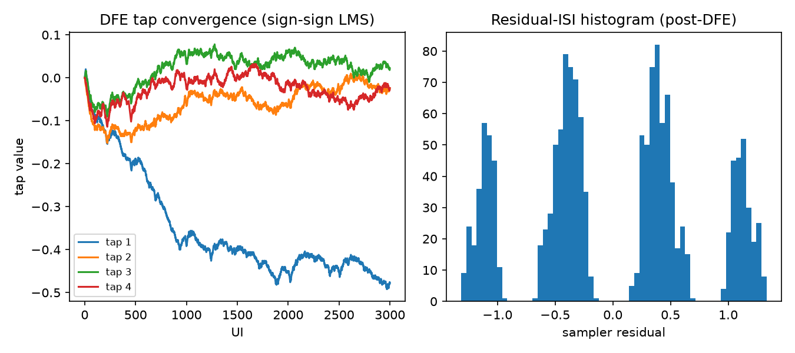
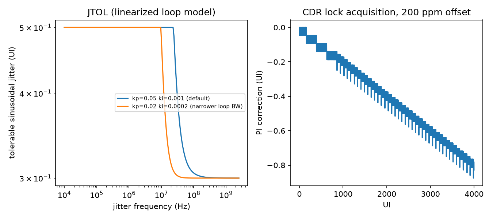
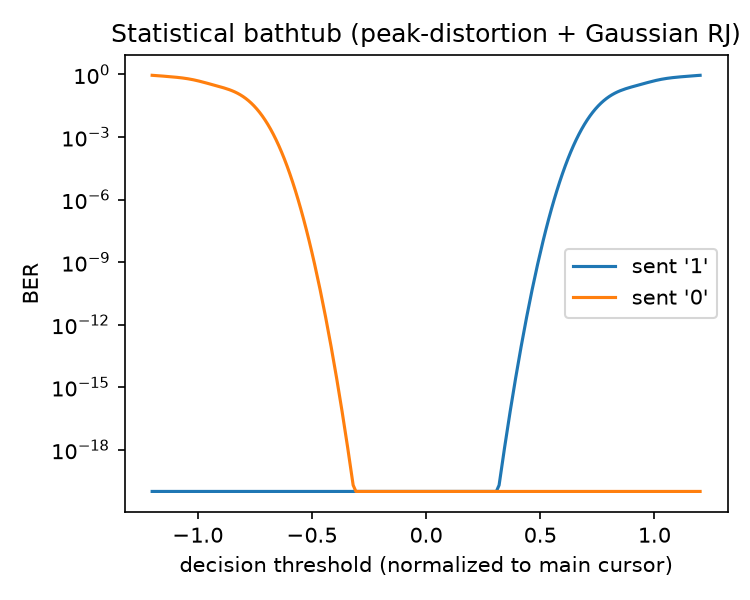

# Stage A: Python Link Model

## Goal

Model a 5 Gb/s NRZ link end to end (lossy channel, TX FFE, CTLE, DFE, CDR)
entirely in Python, on a synthetic channel, and show the whole story in one
place: a closed eye, what each equalization stage buys back, and how well a
bang-bang CDR tracks a frequency offset. No lab gear needed for this stage.

## Procedure

1. **Channel** (`src/serdeslink/channel.py`): load a 4-port single-ended
   Touchstone file, convert to differential mode (`skrf.Network.se2gmm`),
   extrapolate the missing DC point, and IFFT to a causal impulse response.
2. **TX** (`src/serdeslink/tx.py`): PRBS15 -> NRZ -> a small FFE (1
   precursor, 1 postcursor, `[-0.05, 1.0, -0.1]` normalized) -> finite
   rise/fall pulse shaping.
3. **Channel drive** (`src/serdeslink/link.py::drive_channel`): resample the
   channel impulse response onto the TX's sample grid and convolve. Uses
   `scipy.signal.fftconvolve` because direct convolution is too slow at this
   waveform length.
4. **CTLE** (`src/serdeslink/ctle.py`): single-zero/two-pole equalizer,
   swept in the frequency domain. Pick the zero placement that maximizes eye
   height at the UI center (`scripts/sweep_ctle.py`).
5. **DFE** (`src/serdeslink/dfe.py`): 4-tap sign-sign LMS, run on the
   CTLE'd, UI-sampled signal.
6. **CDR** (`src/serdeslink/cdr.py`): closed-loop bang-bang (Alexander)
   phase detector, 2nd-order digital loop filter, and finite-resolution
   phase interpolator, run directly on a continuous oversampled waveform
   with an injected TX/RX ppm offset. This is bit-level, not the linearized
   model.
7. **JTOL** (`src/serdeslink/analysis/jitter.py`): a linearized small-signal
   model of the same loop filter, to get the textbook JTOL *shape*.
   Tolerance is flat at low frequency, rolls off around 20 dB/decade past
   the loop bandwidth, then flattens again at the eye-margin floor.
8. **Statistical BER** (`src/serdeslink/analysis/ber.py`): peak-distortion
   method. Build the ISI amplitude PDF from the channel's pulse-response
   cursors, convolve with Gaussian noise/RJ, and integrate the tails. No
   1e-12 Monte Carlo.

One command regenerates every figure below:

```
python scripts/run_link.py
```

## Results



The raw channel eye at 5 Gb/s over 12 inches of synthetic FR4 is fully
closed. That's the problem statement, not a bug. Causality check on the
recovered impulse response: energy-before-peak fraction 0.06% (see the
console output of `run_link.py`), so the channel model is well-behaved.



Sweeping the CTLE zero from about 0.3 GHz to 4 GHz, eye height (still
measured before the DFE) peaks around 8-10 dB of realized peaking and then
*degrades* past roughly 15 dB. Over-peaking amplifies noise and
high-frequency content faster than it recovers signal, exactly the effect
the project howto calls out. Even at the best CTLE setting the eye is still
far from open. This channel needs the DFE.

The dashed curve and star are `analysis/optimize.py`'s fit: a least-squares
quadratic through the swept points, solved for its vertex, so the reported
optimum isn't limited to the 12 grid points actually sampled. On this run
it predicts roughly 11.5 dB, close to the best sampled point (about 9.8 dB);
given how noisy the sweep is at this eye-height scale, treat the fit as a
sanity check on the grid search, not a more precise answer than it is.



Tap 1 (the dominant postcursor) converges to roughly -0.48 of the main
cursor; taps 2-4 stay small. The residual-ISI histogram (right) shows
**four** clusters, not two. That means a single dominant tap does not fully
cancel the ISI at this loss level. There's a real, uncancelled residual
story here, not a decorative "opened eye."



Left: the linearized JTOL curve for two loop-filter gain sets. The
narrower-bandwidth loop (lower kp/ki) tolerates less low-frequency jitter,
but the two converge to the same high-frequency floor (eye margin), as
expected. Right: the actual bit-level bang-bang CDR (not the linearization)
locking a 200 ppm TX/RX frequency offset. The phase-interpolator correction
ramps linearly (a sawtooth from finite PI resolution) to cancel the offset.



Statistical bathtub from the *raw channel's* pulse-response cursors, not
post-CTLE (see "What went wrong" below), with an assumed 0.05-UI-equivalent
Gaussian RJ term.

## Implementation map

| Stage | Code | Pure/no-plot? |
|---|---|---|
| Channel load + causality | `src/serdeslink/channel.py` | pure |
| TX PRBS/FFE/shaping | `src/serdeslink/tx.py`, `prbs.py` | pure |
| CTLE | `src/serdeslink/ctle.py` | pure |
| DFE | `src/serdeslink/dfe.py` | pure (Stage C golden model) |
| CDR | `src/serdeslink/cdr.py` | pure (Stage C golden model) |
| Eye / BER / JTOL | `src/serdeslink/analysis/` | plotting lives here |
| Figure generation | `scripts/run_link.py`, `sweep_ctle.py`, `sweep_jtol.py` | |
| Tests | `tests/` (pytest, 14 tests) | |

## What went wrong

Three real bugs, in the order I hit them:

1. **Wrong differential port map.** I first built the synthetic 4-port file
   with ports grouped by polarity: (TX+, RX+, TX-, RX-). scikit-rf's
   `se2gmm(p=2)` actually assumes ports grouped by near-end/far-end:
   (TX+, TX-, RX+, RX-). The symptom wasn't an error, it was *silent*
   garbage: an SDD21 that was exactly zero at every frequency. A white-box
   unit test (`tests/test_channel.py::test_sdd21_matches_single_ended_line`,
   comparing against two intentionally *uncoupled* lines, where SDD21 must
   equal a single line's S21 exactly) caught it right away. This is exactly
   the "wrong ports = garbage" failure mode the project howto warns about.
2. **Backwards LMS sign.** The sign-sign DFE update used
   `taps += mu * sign(error) * sign(past)`, which is positive feedback. A
   single tap that should converge to a known 0.3 postcursor instead ran
   away to about -82 in a few thousand updates. Gradient *descent* on the
   slicer-error energy needs a minus sign. Caught by
   `tests/test_dfe.py::test_single_tap_converges_to_known_postcursor`.
3. **CDR feedback sign and a unit mismatch.** Two bugs stacked in `cdr.py`.
   First, the loop-filter gain (`kp`, `ki`, meant as UI-scale gains) was
   being quantized in *samples* without converting units first, so a single
   phase-detector firing rounded to a zero correction almost every time.
   Second and separately, the "late" phase-detector output was being fed
   back with the wrong sign, making the loop *positive* feedback. The
   failure mode was subtle: the loop still nominally looked like it was
   "doing something," but a fixed starting offset of 0 or -0.2 UI both
   drifted toward the same +/-0.5 UI eye boundary instead of converging to
   0. I caught it by manually sweeping `initial_phase_offset` with
   `kp=ki=0` (isolating the sampler from the loop, which gave 0% bit
   errors) versus with the loop active (which diverged regardless of
   starting sign). That was a nonobvious debugging step the unit tests
   didn't catch on their own; the tests were tightened afterward
   (`tests/test_cdr.py`) to check convergence from a nonzero starting
   offset, not just from zero.

One known, documented simplification is left as-is (not a bug): the
statistical bathtub (`fig_bathtub`) uses ISI cursors from the *raw channel*
pulse response, while the DFE operates on the *CTLE'd* signal, whose
effective ISI is reshaped (and, at high peaking, worsened) by the CTLE
itself. The two don't describe the same signal. A more complete Stage A
would derive the bathtub cursors post-CTLE. Noted here instead of glossed
over.

## References

- scikit-rf docs: https://scikit-rf.readthedocs.io
- Alexander, J.D.H. "Clock recovery from random binary signals," Electronics
  Letters, 1975. The bang-bang phase detector.
- Standard StatEye / peak-distortion BER method (dual-Dirac RJ/DJ language).
- CEI/OIF JTOL mask *shape* referenced for literacy only, no compliance
  claim (see the honesty line in the README and `docs/00-spec.md`).
