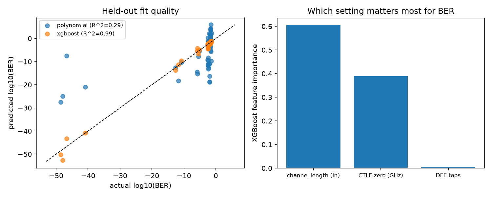

# Applied Math In Use

This page exists to make the math/estimation/optimization coursework
behind this repo's design choices *visible*, not just claimed. One block
per result: the formula, the course/book it's from, the code that
implements it, and the plot that proves it.

Started with Workstream 1 (the optimal equalizer), Workstream 2
(detection-theory BER), and Workstream 3 (a regression surrogate on sweep
data). A Kalman-filter view of CDR phase tracking is a follow-on
workstream, not yet built; see `career/p1-applied-math-extension.txt`
(planning repo, private) for the roadmap.

## Workstream 1: the optimal equalizer (MMSE / least squares / convex)

**Formula**

MMSE / Wiener-Hopf estimation:

```
w* = R^-1 p,   R = E[y y^T]  (regressor autocorrelation)
               p = E[y d]    (regressor / desired-value cross-correlation)
```

which is the same object as ordinary least squares:

```
minimize ||Y w - d||^2   ->   w = (Y^T Y)^-1 Y^T d
```

and, with a tap-magnitude budget added (a real constraint: a TX has a fixed
output-swing budget to split across taps, exactly what `tx.py`'s
`sum(|tap|) == 1` FFE normalization already enforces elsewhere in this
repo):

```
minimize ||Y w - d||^2   s.t.  ||w||_1 <= budget      (a convex QP)
```

**Book / course**

EECS126 (linear least-squares estimation / MMSE), EECS127 + Boyd &
Vandenberghe's *Convex Optimization* ch. 4 (least squares, convex
constraints), 16A/16B (linear algebra, normal equations).

**Code**

`src/serdeslink/analysis/equalizer_opt.py`:
- `build_regressor_matrix(decisions, n_taps)`: the DFE's own regressor,
  past decisions ordered most-recent-first, exactly matching `dfe.py`'s
  `past` tap-history convention.
- `mmse_taps(Y, d)`: solves `R w = p` directly.
- `ls_taps(Y, d)`: the same optimum via `numpy.linalg.lstsq` (more robust
  when `R` is close to singular).
- `convex_taps(Y, d, budget)`: the same objective with an L1 tap-budget
  constraint, via `cvxpy` (solved with CLARABEL; see the code comment for
  why the default solver was swapped out).

`dfe.py`'s `run_dfe` was NOT changed. It already existed and already runs
sign-sign LMS; this workstream shows what LMS is converging toward,
computed independently, next to it.

**Result**


On a known 3-tap postcursor channel (`0.30, -0.15, 0.05`, noiseless so the
optimum is exactly solvable), the settled sign-sign LMS taps
(`0.2996, -0.1498, 0.0505`) match the closed-form MMSE solution
(`0.3000, -0.1500, 0.0500`) to within LMS's own steady-state dither, not
just the true channel value — this is the literal "LMS converges to MMSE"
claim, checked directly rather than assumed. `ls_taps` agrees with
`mmse_taps` to numerical precision. `convex_taps` with a loose budget
reproduces the same optimum; with a budget tight enough to bind
(half the unconstrained solution's L1 norm), it's forced to give up some
of tap 3 entirely, and its mean-squared ISI-prediction error is measurably
worse than the unconstrained optimum's, exactly demonstrating a real
constraint a closed-form formula can't express but a solver can.

Reproduce: `python scripts/run_equalizer_opt.py`. Tests:
`tests/test_equalizer_opt.py` (3 tests: LMS-vs-MMSE agreement, convex
matches the unconstrained optimum when the budget is loose, convex
respects a binding budget and pays for it in fit error).

## Workstream 2: the slicer is a MAP detector

**Formula**

The sampler's slicer is choosing between two hypotheses (H0: bit sent =
-1, H1: bit sent = +1) from one noisy observation. The Bayes-optimal
(MAP) rule is the likelihood-ratio test:

```
decide H1  iff  p1 * f1(t) > p0 * f0(t)
```

`ber.py`'s existing `bathtub()` already computes each hypothesis's tail
probability with a Gaussian CDF -- that IS `P(error) = Q((c0 - |ISI|) /
sigma)`, it just wasn't named as detection theory. It also implicitly
assumes the optimal threshold is exactly 0, true only for a **symmetric**
channel (mirrored means, equal noise, equal priors). Solving the
likelihood-ratio equation directly for equal-variance hypotheses gives a
closed form:

```
t* = (mu0 + mu1)/2 + sigma^2/(mu1 - mu0) * ln(p1/p0)
```

which collapses to 0 exactly under symmetry, and to the weighted midpoint
under a DC-offset-style level asymmetry. For unequal variances the
equation is quadratic in `t`; solved numerically here (`scipy.optimize.
brentq`, bracketed between the two means) rather than by hand-selecting
between two algebraic roots.

**Book / course**

EECS126 (binary hypothesis testing / MAP detection, Walrand's
*Probability in Electrical Engineering and Computer Science*).

**Code**

`src/serdeslink/analysis/ber.py`:
- `optimal_threshold(mu0, sigma0, mu1, sigma1, p0, p1)`: the MAP threshold,
  closed-form when variances match, numeric otherwise.
- `error_probability(threshold, mu0, sigma0, mu1, sigma1, p0, p1)`: total
  P(error) at a given threshold, the same Q-function construction
  `bathtub` already uses, generalized so it can be evaluated away from 0.

`bathtub()` and `isi_pdf()` were NOT changed; they remain the right tool
for the symmetric-channel peak-distortion case this repo's channel
actually produces. The new functions are for when that symmetry doesn't
hold.

**Result**


Two asymmetric scenarios, each a real SerDes non-ideality: duty-cycle
distortion (the '0' and '1' levels aren't exact mirrors) and heteroscedastic
noise (different effective sigma on each side, e.g. from unequal residual
ISI). In both, the naive threshold=0 is measurably wrong, and the derived
MAP threshold is a strict improvement with no other change to the link:
10.9x lower error probability under the tested level asymmetry, 34.2x
lower under the tested noise asymmetry. `test_error_probability_matches_
bathtub_in_symmetric_case` checks the new general formula reduces to
`bathtub`'s own existing number for the ordinary symmetric case, so
nothing here contradicts what was already validated.

Reproduce: `python scripts/run_ber_threshold.py`. Tests: `tests/test_ber.py`
(5 tests: symmetric case gives exactly 0, closed-form level-asymmetry
shift, the derived threshold beats naive 0 under noise asymmetry, a
brute-force grid-search cross-check for the no-closed-form case, and
agreement with `bathtub` in the symmetric case).

## Workstream 3: a regression surrogate on sweep data

**Formula**

`optimize.py` already fits eye height vs. a SINGLE swept variable (CTLE
peaking) with a 1-D quadratic and solves for its vertex. Workstream 3
generalizes this to several settings at once:

```
x = (channel length, CTLE zero frequency, DFE tap count)
y = log10(BER)
y_hat = f(x)
```

starting with plain polynomial regression (the normal equations again,
now on more than one input dimension: `y = X_poly @ w`, `w = (X^T X)^-1
X^T y` via `lstsq`), then a gradient-boosted tree model (XGBoost) for
whatever a fixed-degree polynomial can't represent. Feature
importances/sensitivities are read as design intuition (which knob
actually moves BER the most), and the fitted surrogate can propose good
settings by searching over the CHEAP model instead of the expensive real
sweep -- the same idea as `optimize.fit_optimal_peaking`'s vertex, just
for more than one dimension where there's no closed-form vertex to solve
for directly.

**Book / course**

EECS189 (regression, bias/variance, model capacity: Murphy's
*Probabilistic Machine Learning*, Prince's *Understanding Deep Learning*).

**Code**

`src/serdeslink/analysis/surrogate.py`:
- `polynomial_features(X, degree=2)` / `fit_linear_regression(X, y)`: an
  explicit, readable polynomial design matrix (bias, linear, squared, and
  pairwise-interaction terms) and its normal-equations fit.
- `PolynomialSurrogate`: wraps the two above into a `.fit`/`.predict`
  object, plus `.coefficient_table()` for inspecting the fitted terms.
- `fit_xgboost_surrogate(X, y)`: the same (X, y) fit with `xgboost.
  XGBRegressor`, whose `.feature_importances_` is the design-intuition
  readout.
- `suggest_settings(predict_fn, bounds, integer_dims)`: random search over
  a fitted surrogate (cheap to evaluate) instead of the real, expensive
  sweep.

`scripts/sweep_and_fit.py` generates the dataset: for each of 6 channel
lengths (4-24 in) x 6 CTLE zero placements x 6 DFE tap counts (216 points
total), it builds/loads the corresponding synthetic channel, runs
TX -> channel -> CTLE -> DFE, and turns the post-DFE residual into
`log10(BER)` via `ber.error_probability` (Workstream 2's own detection-
theory function, reused here as the sweep's target metric instead of
inventing a new one: `mu = 1` since decisions are always +-1 by
construction, `sigma` = the residual's spread around the actual decided
level).

**Result**



On a held-out 25% split, the degree-2 polynomial gets R^2 = 0.29; XGBoost
gets R^2 = 0.99. This isn't a close contest and that's the point: log10(BER)
here spans roughly -53 to -1 (a completely realistic range for real BER
specs, which routinely span many orders of magnitude), and that's a
genuinely non-quadratic response surface no fixed-degree polynomial can
track well, while a tree-based model handles it easily. This is the
EECS189 bias/variance story directly, not just named: a low-capacity
model underfits, and the fix is a higher-capacity model, not a
better-tuned low-capacity one.

The feature importances say something real about THIS channel/pipeline:
channel length dominates (~0.60), CTLE zero placement matters almost as
much (~0.39), and DFE tap count barely moves the needle (~0.01) once the
channel and CTLE are already in a reasonable range. That is a legitimate
design read: for this link, getting the channel length/loss budget and
the CTLE right matters far more than adding more DFE taps.

`suggest_settings` run on the fitted XGBoost surrogate proposes a length/
CTLE/tap-count combination predicting an extremely low BER (log10(BER)
around -53). That number itself shouldn't be read too literally: once BER
is already astronomically small, many nearby settings are all
"essentially zero" and the exact ranked order among them is dominated by
noise in the 1500-sample residual estimate the sweep uses, not by a real
difference in link quality. The surrogate's genuinely useful output here
is the broad trend and the feature ranking above, not the single "best"
point in an already-flat, near-zero region.

Reproduce: `python scripts/sweep_and_fit.py`. Tests: `tests/test_surrogate.py`
(6 tests, all on synthetic data with a known ground truth rather than the
expensive real sweep: polynomial-feature expansion correctness, R^2
sanity, the polynomial surrogate recovering a known quadratic, XGBoost
beating polynomial regression on a function no quadratic can fit,
`suggest_settings` finding a known minimum, and its integer-rounding
option).
