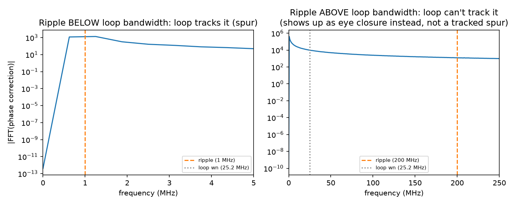
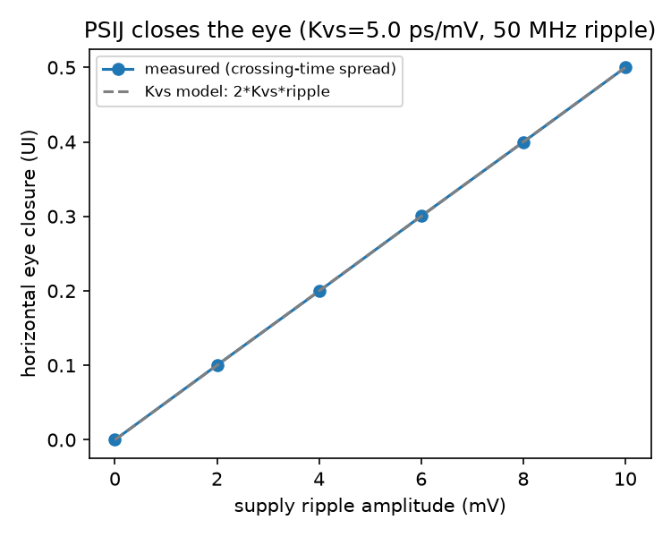

# Power Integrity: Power-Supply-Induced Jitter (PSIJ)

Workstream 1 of the PDN/power-integrity extension (see
`career/p1-pdn-power-integrity.txt` in the planning repo, private): make
supply noise a first-class term in the link model instead of leaving power
as an unmodeled assumption. PDN target impedance/decoupling design and a
VNA-measured PDN impedance overlay (workstreams 2-3) are not built yet.

## Model

A driver or clock buffer's supply-delay sensitivity `Kvs` (picoseconds of
edge-timing shift per millivolt of supply ripple) turns periodic supply
ripple into periodic (deterministic) edge jitter:

```
Vn(t)  = ripple_mv * sin(2*pi*ripple_freq_hz*t)     # supply ripple
dt(t)  = Kvs * Vn(t)                                # timing modulation
```

`tx.apply_supply_jitter` applies this as a literal time warp of the
already-shaped TX waveform: the value that should land at time `t` instead
reads the ideal waveform's value from time `t - dt(t)`, exactly what "the
edge arrived `dt(t)` early/late" means. At `ripple_mv=0` it's the identity
(checked in tests). This is genuinely different from the DFE/CTLE
machinery elsewhere in the repo (which all operate on AMPLITUDE); PSIJ is
a TIMING effect, which is why it needed its own measurement approach (see
below).

## What happens next depends on the CDR's loop bandwidth

The link already has a bang-bang CDR with a known tracking transfer
function (`jitter.jitter_transfer`, used for JTOL). PSIJ ties directly
into it: ripple BELOW the loop's natural frequency gets tracked out (the
loop's phase correction visibly chases it); ripple ABOVE it passes through
untracked and shows up as residual sampling-instant error instead. This
isn't a new assumption, it's the same loop-bandwidth story JTOL already
tells, applied to a different jitter source.



Left: a 1 MHz ripple (well below the ~25 MHz default loop natural
frequency) produces a clear spur in the CDR's own tracked phase-correction
spectrum -- `demo_psij_spectrum` runs the real bit-level `cdr.run_cdr` on
the jittered waveform and looks at the periodogram of its output. Right: a
200 MHz ripple (well above the loop bandwidth) produces no such spur; the
loop simply can't follow it, so it doesn't show up in `phase_ui` at all.
That's not a lack of effect, it means the ripple now needs a different
measurement, the one below.

## Eye closure (the ripple that doesn't get tracked out)



`demo_psij_eye_sweep` measures the HORIZONTAL (timing) eye opening via
`eye.crossing_jitter_ui`, a new eye metric: peak-to-peak spread of where
PRBS traces cross zero near a UI boundary. This is deliberately NOT
`eye.eye_height` (the existing vertical-opening metric) -- see "what went
wrong" below. Measured on the isolated TX waveform (no channel), the
closure matches the `2 * Kvs * ripple_mv` model to within simulation noise
across 0-10 mV of ripple at a 50 MHz ripple frequency (above this
project's default CDR loop bandwidth, so it isn't tracked out): e.g. 10 mV
of ripple at Kvs=5 ps/mV predicts, and measures, 0.500 UI of peak-to-peak
timing closure.

## What went wrong

1. **`eye_height` (vertical) is the wrong metric for a timing effect.**
   First attempt measured PSIJ's effect on the FULL TX->channel->CTLE
   pipeline's vertical eye height, the same metric `run_link.py` uses for
   the CTLE sweep. Result: noisy, non-monotonic numbers
   (0.0011, 0.0011, 0.0001, ... as ripple increased) that told me nothing.
   The reason: this project's 12" FR4 channel already closes the eye
   VERTICALLY almost entirely through ISI alone at this bit rate, before
   any equalization; PSIJ's contribution was swamped by noise in a metric
   that isn't sensitive to timing shifts in the first place (a signal
   shifted slightly in TIME doesn't change what's sampled in a fixed
   VERTICAL band unless the shift is large enough to cross into a
   different symbol's amplitude). The fix was a new metric,
   `eye.crossing_jitter_ui`, that measures the HORIZONTAL spread of
   zero-crossings near a UI boundary instead -- the actual eye-diagram
   quantity real jitter/TIE measurements use, and one that isn't
   entangled with this channel's own severe ISI.
2. **A hidden one-sample delay in `tx.apply_ffe`, at the identity
   setting.** The first version of the isolated (no-channel) PSIJ demo
   built its TX waveform via `link.generate_tx_waveform(..., ffe=(0.0,
   1.0, ()))`, intending a no-op FFE. Baseline (zero-ripple) crossing
   spread came out to 0.17 UI instead of the expected exact 0.0. Root
   cause: `apply_ffe`'s convolution with taps `[0.0, 1.0]` doesn't
   reproduce the input; because a precursor tap only makes sense as an
   overall processing delay in a causal filter, the convolution shifts
   the whole sequence by one sample AND inserts a single stray `0.0`
   symbol at the start (confirmed directly: `np.convolve([1,-1,1,1,-1],
   [0,1], mode="full")[:5] == [0, 1, -1, 1, 1]`). That's not a bug in
   `apply_ffe` (a precursor tap genuinely can't be applied without a
   causal delay, and nothing downstream cares about absolute bit-index
   alignment), but it meant this PSIJ demo, which has no channel for an
   FFE to equalize against in the first place, had no reason to go
   through `link.generate_tx_waveform` at all. Fixed by building the
   waveform directly (`prbs` -> `nrz_symbols` -> `rise_fall_shape`), the
   same pattern `jitter.demo_lock_acquisition` already used.
3. **The crossing-search window has its own validity range.**
   `eye.crossing_jitter_ui` only looks for a zero-crossing within a window
   around the expected UI boundary (`search_band_ui`, default 0.6 UI).
   Once injected peak-to-peak jitter approaches that window's width, some
   crossings fall outside it and get silently skipped, and the measured
   spread saturates below the true value (confirmed: 12 mV of ripple
   measured 0.561 UI against a 0.600 UI prediction, while every point at
   10 mV and below matched to 4 decimal places). The eye-closure sweep
   figure stops at 10 mV deliberately, inside the validated range, rather
   than showing a data point that's a measurement-window artifact instead
   of physics.

## Implementation map

| Piece | Code |
|---|---|
| Supply-ripple timing modulation | `src/serdeslink/tx.py::apply_supply_jitter` |
| Horizontal (timing) eye metric | `src/serdeslink/analysis/eye.py::crossing_jitter_ui` |
| PSIJ eye-closure sweep + spectrum | `src/serdeslink/analysis/jitter.py` (`demo_psij_eye_sweep`, `demo_psij_spectrum`) |
| Figures | `scripts/run_psij.py` |
| Tests | `tests/test_tx.py`, `tests/test_psij.py` |

## References

- Kvs-style supply-to-timing sensitivity modeling and PSIJ as a
  deterministic-jitter contributor: standard SerDes/PLL power-integrity
  treatment (any modern high-speed-link power-integrity text or app note
  on PSIJ covers this model).
- The CDR loop-bandwidth-dependent tracking behavior reuses this repo's
  own linearized loop model (`jitter.loop_natural_freq_and_damping`,
  `jitter.jitter_transfer`), already validated for JTOL in docs/01-model.md.
