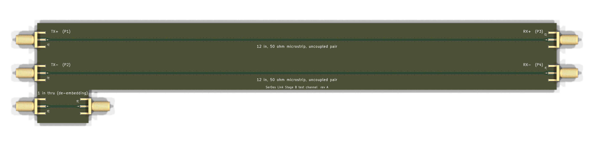

# Stage B: 12 inch test channel board

A draft KiCad board for measuring a real channel with a VNA, to replace the
synthetic channel in `data/touchstone/`. It has not been fabricated or
measured yet.



## What is on the board

| Item | Detail |
|---|---|
| Two 12 inch lines | 50 ohm microstrip on F.Cu, pad center to pad center, 20 mm apart. They stand in for the two uncoupled lines (TX+ to RX+, TX- to RX-) assumed by `make_synthetic_channel.py`. Ports: J1 TX+, J2 TX-, J3 RX+, J4 RX-, the same order the model uses. |
| 1 inch thru | J5 to J6, with identical connectors and launches. Measuring it gives the connector and launch response, which can be de-embedded from the 12 inch results. |
| Connectors | Six Amphenol 132289 edge-launch SMA connectors. |
| Stackup | 4 layers, 1.6 mm. F.Cu carries the lines, In1.Cu is a solid ground reference, In2.Cu and B.Cu are ground. |
| Launch | Each line tapers from the 1.5 mm connector pad to the trace over 3 mm. In1.Cu is cleared under the pad and taper, so the wide pad does not load the launch. |
| Shielding | A row of ground vias 1.2 mm from each side of every line, every 2 mm. |

The schematic is `serdes_test_channel.kicad_sch`. It is six coaxial
connectors joined by three nets: `CH_P` (J1 to J3), `CH_M` (J2 to J4) and
`THRU` (J5 to J6).

## Impedance

The trace is 0.16 mm wide. With about 0.1 mm of prepreg (er near 4.05)
between F.Cu and In1.Cu, the Hammerstad-Jensen microstrip formula gives about
50.6 ohms. Prepreg thickness and dielectric constant vary by fab and stackup,
so confirm the width with the fab's impedance calculator before ordering. The
board specifies a controlled-impedance stackup for that reason.

## Checks

| Check | Result |
|---|---|
| KiCad design rule check | 0 violations, 0 unconnected items |
| Schematic electrical rules check | 0 errors, 0 warnings |

The copper-to-edge clearance rule is set to ignore in
`serdes_test_channel.kicad_pro`, because edge-launch pads and the ground
pours reach the board edge on purpose.

## Files

| File | What it is |
|---|---|
| `serdes_test_channel.kicad_pro`, `.kicad_sch`, `.kicad_pcb` | KiCad project, schematic and board |
| `serdes_test_channel_gerbers.zip` | Gerbers and drill file for a fab |
| `make_test_channel_pcb.py`, `make_schematic.py` | Scripts that generate the board and schematic, run with KiCad's bundled Python |
| `img/` | Schematic and 3D render |

To regenerate:

```bash
"C:/Program Files/KiCad/10.0/bin/python.exe" pcb/make_test_channel_pcb.py
"C:/Program Files/KiCad/10.0/bin/python.exe" pcb/make_schematic.py
```

## Next

1. Confirm the trace width with the fab's calculator and order a small run.
2. Measure the thru and both 12 inch lines with a VNA (SOLT calibrated at the
   cable ends).
3. Save the 4-port result as a Touchstone file in `data/touchstone/` and
   point `channel.load()` at it. No code changes are needed.
